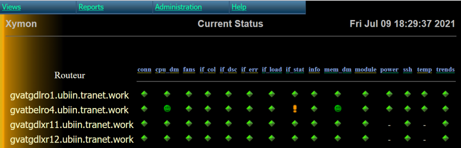

<!DOCTYPE markdown>
# Devmon
>   Devmon is an open-source SNMP monitor tool that can graph and alert
  several hundreds of devices per minutes

[More screenshots] https://wiki.ubiquitous-network.ch/doku.php?id=en:devmon:screenshots

## What is new!
- This is the first SNMPv3 release! (8.2021)
  - Backup your server before upgrade
  - Install Net-SNMP lib
  - Expect bugs!
  - Enjoy new speed...

## What are we working on? (In order):
  - GitHub issues (are the current roadmap)
  - Organization of the code and best practice (Modern standard)
  - Documentation
  - Compatibility with IPv6
  - Compatibility with and all forms of clustering
  - Own discovery/ping test?
    - Improve stability
    - Improve perf

## General Information
- Devmon is a Perl daemon designed to enhance the SNMP monitoring capabilities
  of a server running Xymon monitoring software
- Devmon takes the data that it obtains via SNMP and applies user- defined
  logic against it and compares the results to user-customizable thresholds.
  It uses the final data to determine if the remote device is in an abnormal
  or critical state, and reports accordingly to the Xymon display server.
- Devmon provides a solution that is very efficient, fault-tolerant, scalable
  and maintainable.
- Devmon supports a flexible, user-customizable template system, which allows
  an end user with little or no programming knowledge to easily create test
  logic for any number of different types of devices.

## Technologies Used
- Xymon
- SNMP
- Perl5
- MySQL (for multi-node configuration)

## Features

- Multithread polling engine
  - Devmon is able to spawn a user-configurable number of child processes to
    offload the SNMP v1,v2c,v3 query workload to. This allows for the rapid
    query of a large number of remote devices.
- Device discovery process
  - Scan each device for any SNMP security authentication combination and
    store it in a persistent storage until a re-scan is performed
- A scalable tool
  - For smaller networks (<200 devices), Devmon can be run in a "single
    node" configuration, and can be run from the same server as the Xymon
    display server.
  - For larger, enterprise networks, Devmon can run in a 'multi node
    (cluster)' configuration (WIP), with all nodes using a MySQL back- end
    server (which can also be a cluster, for maximum fault tolerance) for data
    storage, load balancing, and fault tolerance or simply in "single node" in
    its own dedicated server (recommended so far)

## Setup
- In order for Devmon to do anything useful, you will need a machine capable
  of running the Perl interpreter, which is used to execute the Devmon code.
  Please consult the INSTALLATION file located in the docs directory.
- In addition, you will need a machine (either the same machine running
  Devmon, or a different one) running the Xymon monitoring program, which
  displays the messages that Devmon generates.
- Finally, you will need your to have your Xymon program set up to monitor at
  least one host that Devmon has a template for. Only then will Devmon be able
  to poll a remote host and display the results. For more information on
  Devmon's template system, please consult the TEMPLATES file located in the
  docs directory.

## Project Status
- The project is: _in progress_
- Version is still < 1 (as we can guaranty backward compatibility with
  previous version)

## Wiki
- http://wiki.ubiquitous-network.ch/doku.php?id=en:devmon
- Devmon developers: "must read" best practice
- [Screenshots]: https://wiki.ubiquitous-network.ch/doku.php?id=en:devmon:screenshots

## Contact
Created by [XXXXX/) - feel free to contact me!
